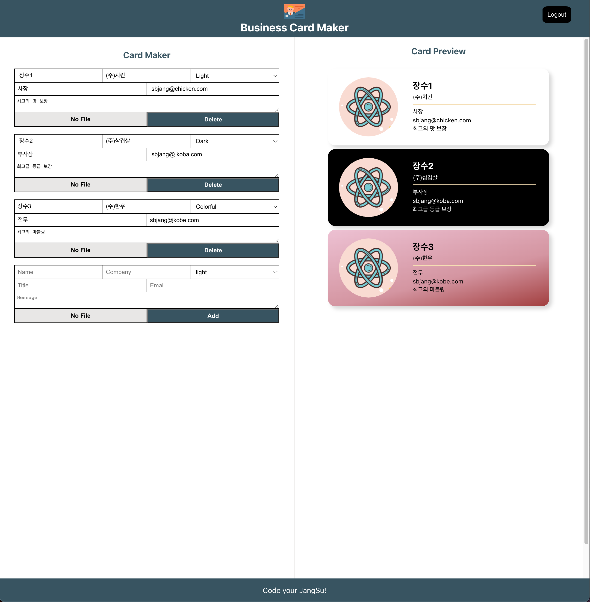

# 명함 제작 앱 (연습용)

간단한 전자 명함 제작을 위한 반응형 웹 제작

> 파이어베이스 리얼데이터베이스 사용으로 인해 동시 작업 시 실시간 반영

## 개발환경

- MacOS
- VSCode
- Nodejs 17
- Chrome

## 기술스택

- React 18 (React Hooks)
- React Router (v6)
- Yarn Berry
- firebase (v9)
- cloudinary
